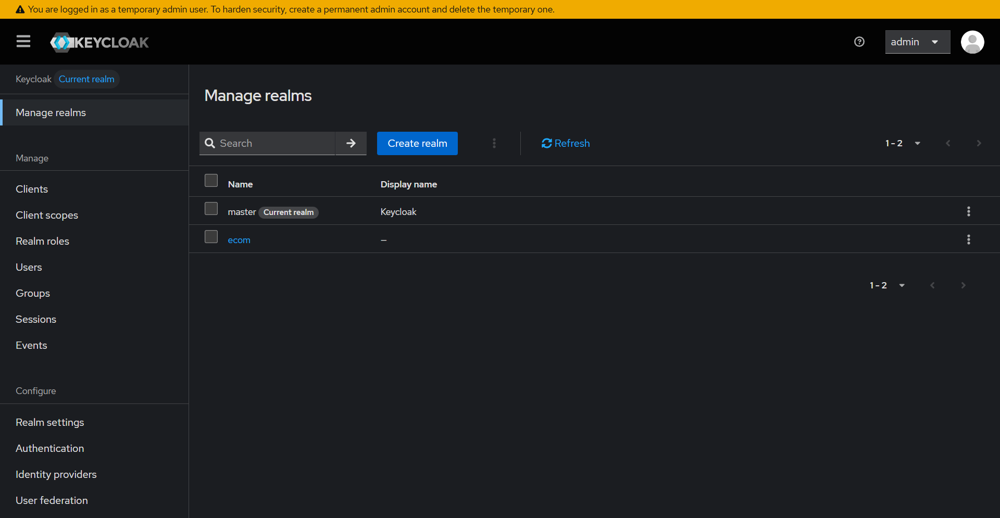
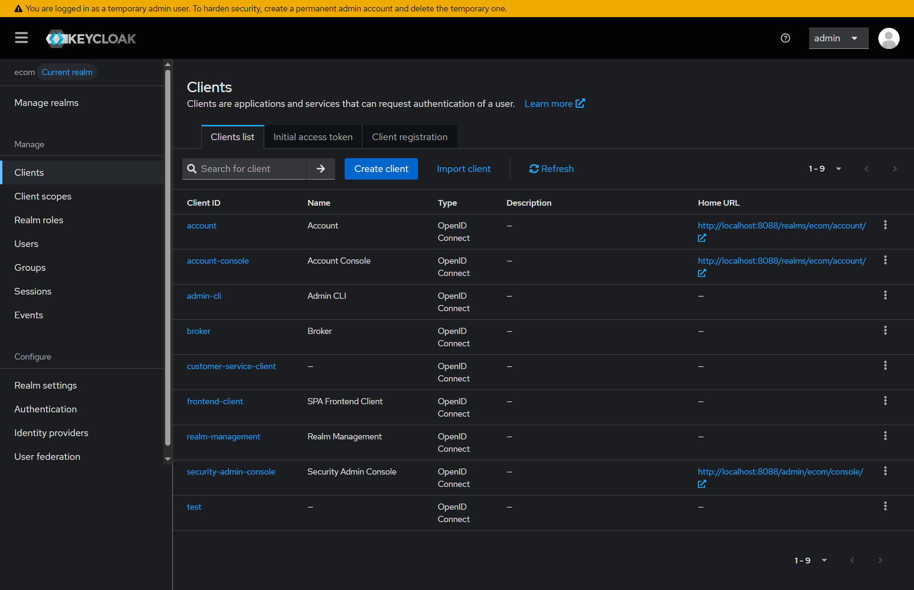
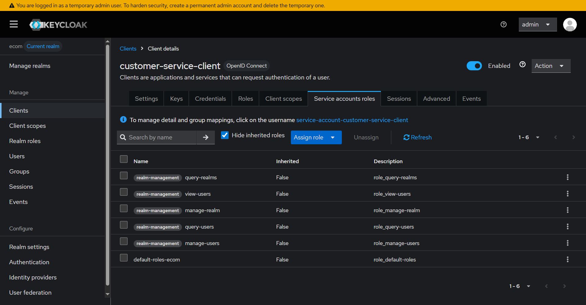
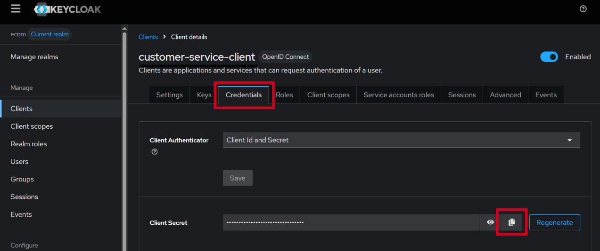
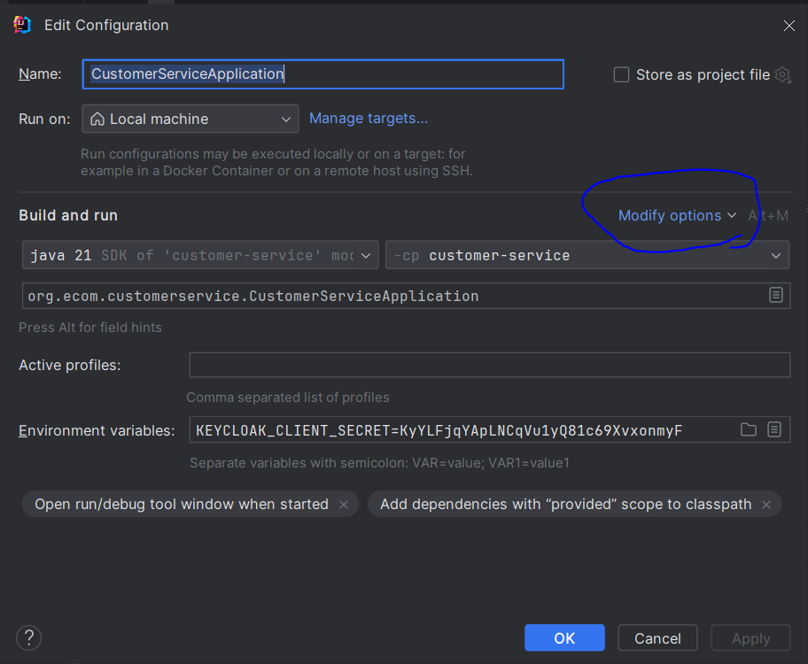
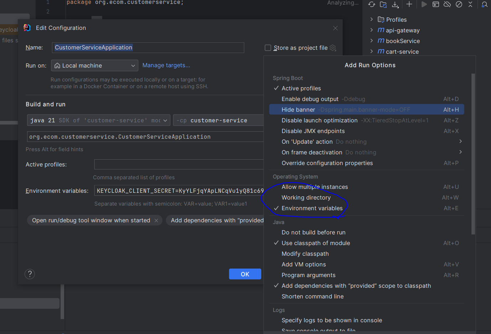
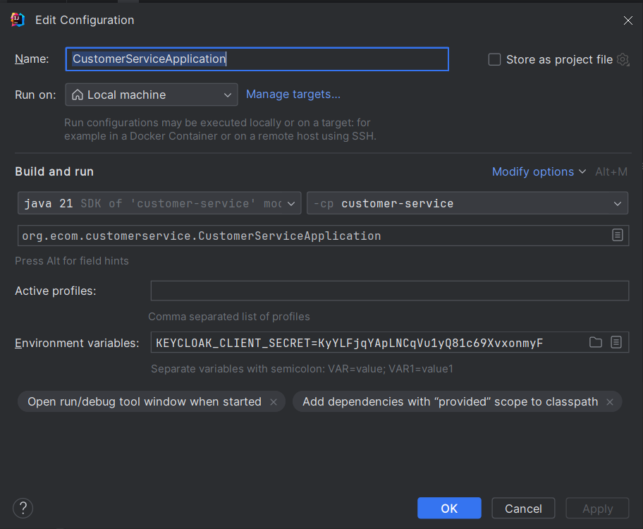

# Quick Start

Keycloak avec Docker Compose & Gestion des Rôles Utilisateurs.

> ⚠️ Cette configuration manuelle des rôles est indispensable au fonctionnement du service `customer-service`. Sans elle, le service ne pourra pas interagir correctement avec Keycloak.  
> La configuration générale du Realm est, quant à elle, automatisée via la commande `--import-realm` et le fichier de configuration `keycloak/realm.json`.

---

## Prérequis

- [Docker](https://www.docker.com/) & Docker Compose installés

## Configuration

**1. Se placer à la racine du projet**

```sh
cd PROJECT-ECOM    
```

**2. Démarrer Keycloak** :

- **Option A**: uniquement Keycloak
    ```sh
    docker compose ps -d keycloak
    ```

- **Option B**: tous les services
    ```sh
    docker compose ps -d
    ```
---

### Interface d’administration
**Accès:** http://localhost:8088
- Nom d’utilisateur : admin
- Mot de passe : admin

### Attribution des rôles

1. Aller sur [Realms](http://localhost:8088/admin/master/console/#/master/realms) et sélectionner le realm `ecom`
   
    
    *Sélectionner le realm `ecom` dans l'interface Keycloak.*
2. Accéder aux [Clients](http://localhost:8088/admin/master/console/#/ecom/clients)

    
    *Liste des clients du realm `ecom`.*
3. Sélectionner le client `customer-service-client`
4. Aller sur l'onglet `Service accounts roles`
5. Cliquer sur `Assign role` > `Client roles`
   
    
    *Attribuer les rôles de service au compte de service du client `customer-service-client`.*
6. Selectionnez :
   - `view-users`
   - `query-users`
   - `manage-users`
   - `manage-realm`
   - `query-realm`

### Mise à jour du client secret

1. Onglet Credentials 
2. Cliquer sur `Regenerate` (ou `Copy secret`) et copier le nouveau code secret

    
    *Copier le secret du client depuis l'onglet `Credentials`.*
3. Définir la variable d'environnement dans IntelliJ pour le service `customer-service` :

    ```bash
    KEYCLOAK_CLIENT_SECRET=<votre_secret>
    ```

### Exemple : ajouter la variable d'environnement dans IntelliJ

Ouvrez la configuration d'exécution (`Run -> Edit Configurations`) pour l'application `CustomerServiceApplication`, puis utilisez `Modify options -> Environment variables` pour ajouter `KEYCLOAK_CLIENT_SECRET`.

*Cliquer sur `Modify options` puis activer `Environment variables`.*




*Ouvrir la configuration d'exécution et repérer le champ `Environment variables`.*

*Saisir `KEYCLOAK_CLIENT_SECRET=<votre_secret>` dans le champ `Environment variables`.*
